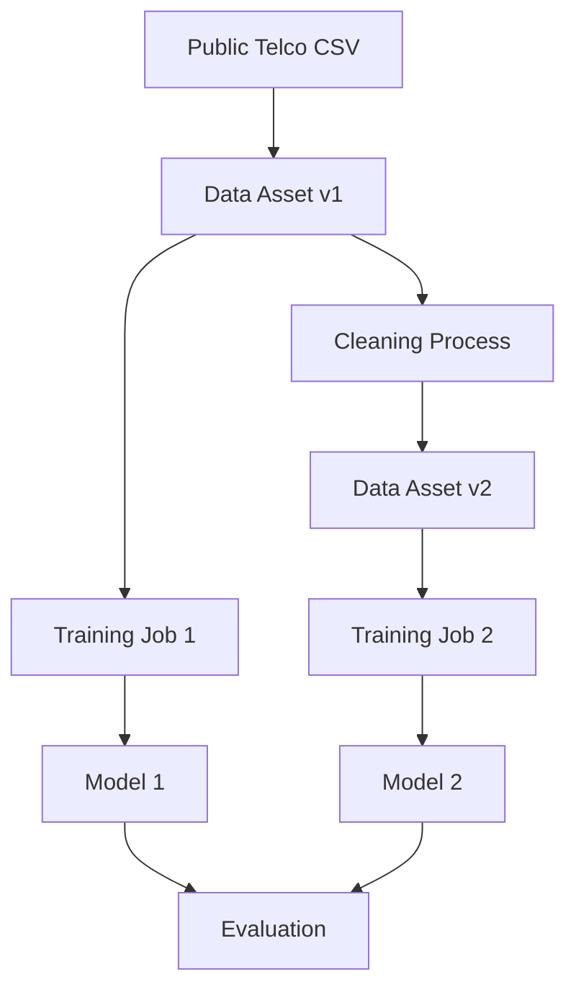
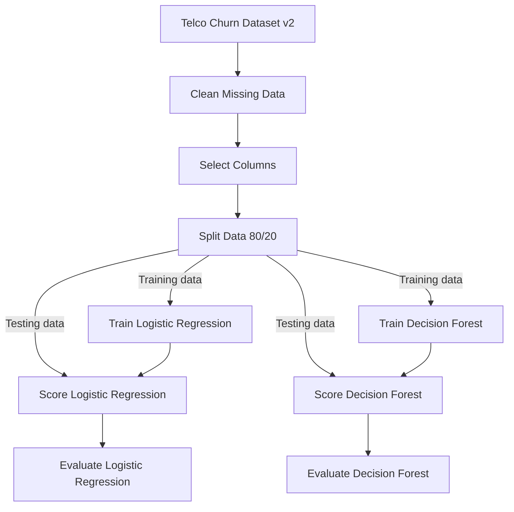

# Data Asset Versioning

```mermaid
flowchart TD
    A["Public Telco CSV"] --> B["Data Asset v1"]
    B --> C["Cleaning Process"]
    C --> D["Data Asset v2"]
    B --> E["Training Job 1"]
    D --> F["Training Job 2"]
    E --> G["Model 1"]
    F --> H["Model 2"]
    G --> I["Evaluation"]
    H --> I
```

# Model Training Pipeline

```mermaid
flowchart TD
    A["Telco Churn Dataset v2"] --> B["Clean Missing Data"]
    B --> C["Select Columns"]
    C --> D["Split Data 80/20"]
    D -->|Training data| E["Train Logistic Regression"]
    D -->|Testing data| F["Score Logistic Regression"]
    E --> F
    F --> G["Evaluate Logistic Regression"]
    D -->|Training data| H["Train Decision Forest"]
    D -->|Testing data| I["Score Decision Forest"]
    H --> I
    I --> J["Evaluate Decision Forest"]
```